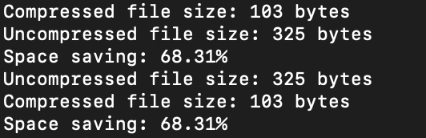

# Lempel-Ziv Compression (C)

The purpose of this project is to perform LZ78 compression and decompression with files, text, or binary. The compression and decompression should work on both big and little endian systems.

## How to Run Locally (Requires: C Compiler)

1. Clone the repo  
  ```bash
  git clone https://github.com/yourusername/fifteen-game.git
  cd lz78-compression
  ```
2. Build the project
  ```
  make
  ```
3. Run the game with desired flags
  ```
    ./encode -i			Sets input file to compress (default: stdin)
    ./encode -o			Sets output file for compressed input (default: stdout)
    ./encode -v			Prints verbose program output
    ./encode -h			Prints out program help and usage

    ./decode -i			Sets input file to decompress (default: stdin)
    ./decode -o			Sets output file for decompressed input (default: stdout)
    ./decode -v			Prints verbose program output
    ./decode -h			Prints out program help and usage
  ```

---

## Files in Repo

| File            | Description                                                                       |
|-----------------|-----------------------------------------------------------------------------------|
| `decode.c`      | Contains implementation and main function for the decode program                  |
| `encode.h`      | Contains implementation and main function for the encode program                  |
| `trie.c`        | Contains implementation and main function for the Trie ADT                        |        
| `trie.h`        | Header file that specifies the interface to trie.c                                |
| `word.c`        | Contains implementation and main function for the Word ADT                        |
| `word.h`        | Header file that specifies the interface to word.c                                |
| `io.c`          | Contains implementation and main function for the I/O module                      |
| `io.h`          | Header file that specifies the interface to io.c                                  |
| `endian.h`      | Header file for endianness module                                                 |
| `code.h`        | Header file containing macros for reserved codes                                  |
| `Makefile`      | Compiles the program using `clang` and applies `clang-format` to all source files |


